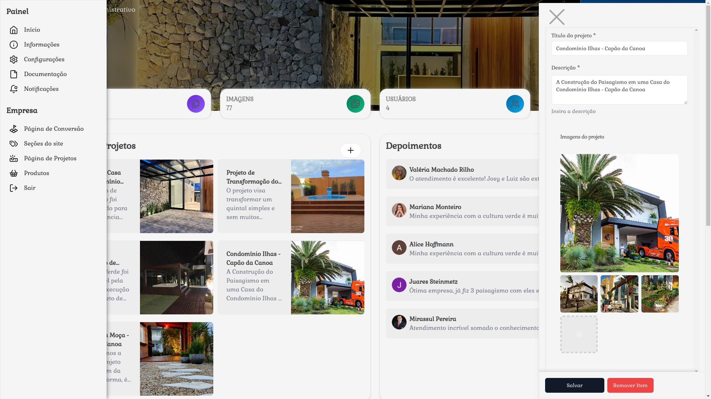
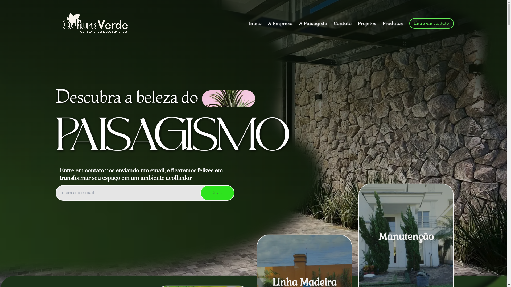

### Summary of DevSehn SaaS

The `devsehn` project is a sophisticated web application built with Next.js, leveraging a variety of modern web development technologies and libraries. This system includes features such as user authentication, dynamic forms, data visualization, and E-commerce. It is designed to be a comprehensive platform that integrates smoothly with a PostgreSQL database using Prisma and offers a robust UI with Tailwind CSS and Radix UI components.

# 🌟 devsehn




## 📖 Description

**devsehn** is a versatile web application built with Next.js, offering a wide range of features including user authentication, dynamic form handling, data visualization, and 3D graphics. It aims to provide a comprehensive and seamless experience for developers and users alike.

## 🎯 Objectives

- **User Authentication**: Secure and efficient user authentication with NextAuth.
- **Dynamic Forms**: Easily create and manage forms with React Hook Form and Zod validation.
- **Data Visualization**: Visualize data with various chart components.
- **Generate landing pages**: Function as a CMS for creating landing pages, intuitively for users and developers.

## 📦 Features

- 🛠 **Admin Dashboard**: Manage your application with a powerful admin interface.
- 📊 **Charts and Metrics**: Display interactive charts and metrics.
- 📸 **Image Uploads**: Seamlessly upload and manage images.
- 🎨 **Custom UI Components**: Utilize a variety of custom UI components for a rich user experience.
- 🌐 **Responsive Design**: Fully responsive design using Tailwind CSS.

## 🚀 Getting Started

### Prerequisites

- **Node.js**: Ensure you have Node.js installed.
- **PostgreSQL**: Setup a PostgreSQL database.

### Installation

Clone the repository and install dependencies:

```bash
git clone https://github.com/USERNAME/devsehn.git
cd devsehn
npm install
```

### Configuration

Create a `.env` file in the root directory and add your environment variables:

```env
POSTGRES_PRISMA_URL=your_POSTGRES_PRISMA_URL
NEXTAUTH_URL=your_nextauth_url
```

### Database Setup

Run Prisma migrations and seed the database:

```bash
npx prisma migrate dev --name init
npx prisma db seed
```

### Monitoring the Database

Run the following command to see prisma data:

```bash
npx prisma studio
```

### Running the Application

Start the development server:

```bash
npm run dev
```

Build and start the production server:

```bash
npm run build
npm start
```

## 📘 Usage

### Admin Dashboard

Access the admin dashboard to manage your application:

```bash
http://localhost:3000/admin
```

### Example Commands

Start the application in development mode:

```bash
npm run dev
```

Build the application for production:

```bash
npm run build
```

Run linting:

```bash
npm run lint
```

## 📚 Technologies Used

- **Next.js**: The React framework for production.
- **React**: A JavaScript library for building user interfaces.
- **Tailwind CSS**: A utility-first CSS framework.
- **Prisma**: Next-generation ORM for PostgreSQL.
- **NextAuth**: Authentication for Next.js.
- **Three.js**: JavaScript 3D library.
- **Framer-motion.js**: Deep and fluid animations that aren't possibly done with just css.
- **React Hook Form**: Performant, flexible, and extensible forms with easy-to-use validation.
- **Zod**: TypeScript-first schema declaration and validation library.

## 🤝 Contributing

We welcome contributions from the community! To contribute, follow these steps:

1. Fork the repository.
2. Create a new branch for your feature (`git checkout -b feature/your-feature`).
3. Commit your changes (`git commit -m 'Add new feature'`).
4. Push to the branch (`git push origin feature/your-feature`).
5. Open a Pull Request.

## 📜 License

This project is licensed under the MIT License. See the [LICENSE](LICENSE) file for more details.

## 💬 Contact

For any inquiries, please contact us at [derikbosing@gmail.com](derikbosing@gmail.com).

---

## Importance for My Career

Devsehn is more than just a project; it is a significant milestone in my career as a web developer. Through this project, I have honed my skills in modern web development practices and explored the integration of various advanced technologies. The knowledge and experience gained from building Devsehn have equipped me with the expertise to tackle complex web development challenges and deliver high-quality solutions. This project serves as a testament to my commitment to continuous learning and professional growth in the ever-evolving field of web development.

Made with ❤️ by devsehn
